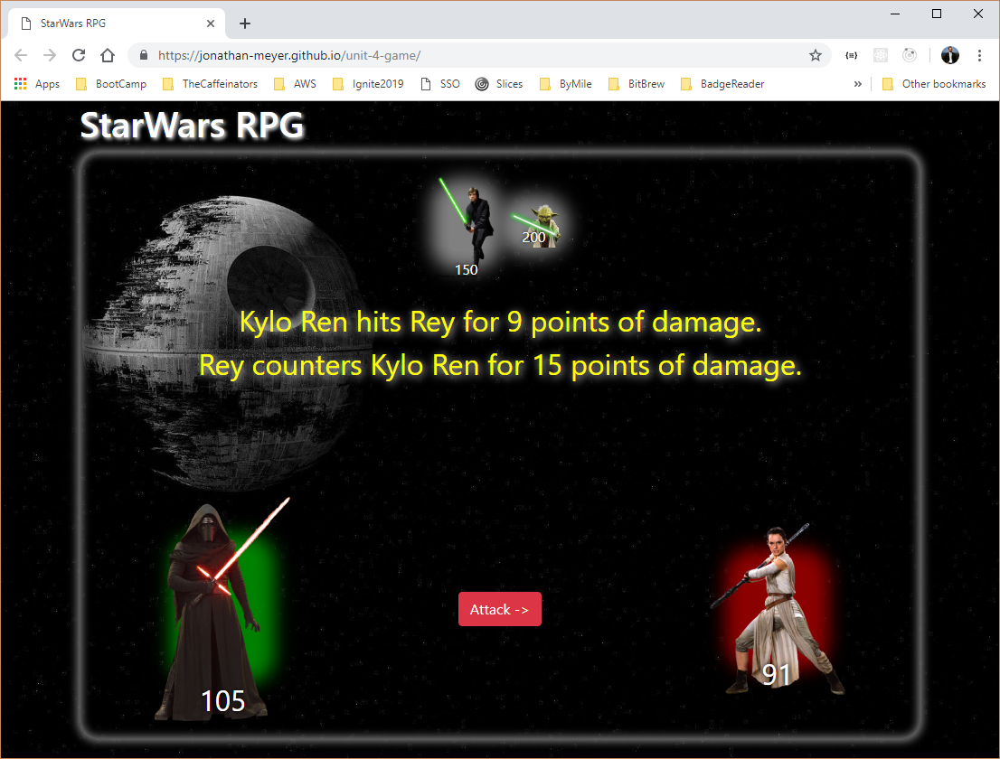

# unit-4-game

This is a simple game where characters have been assigned health, attack power and counter attack power values. When a selected player attacks an opponent their attack power increases. Also when an attack occurs and counter by the opponent happens.

The object is to eliminate all of the opponents before they eliminate you.
